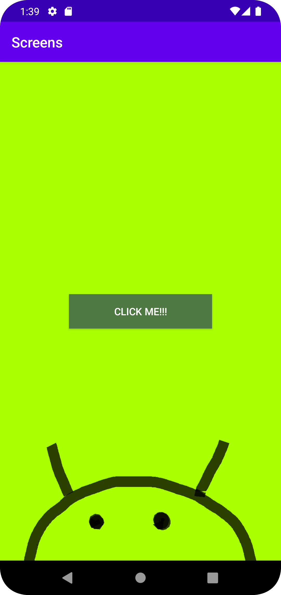
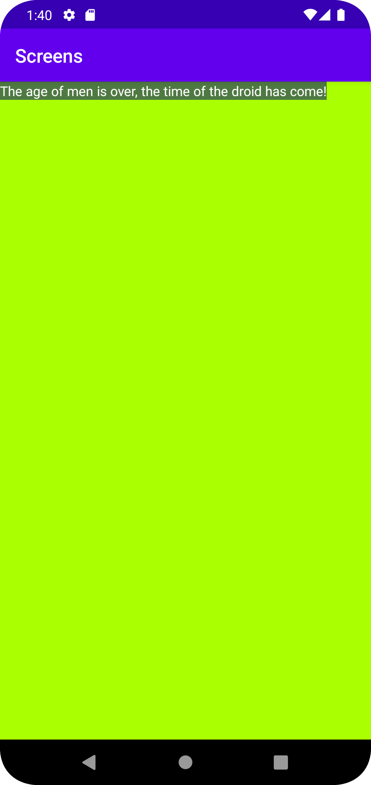

# Report

The first thing I did in this assignment was that I
added a second activity, which I named SecondActivity.
According to the assignment criteria, the main activity
was to include a button that would take the user to the 
second activity, so that was the next thing to implement.

After I did that, I played around a bit
with different colors and I also added a custom ImageView
in the main activity, just for fun.
The only thing that was left after the button was implemented,
was to add an extra intent, as that was the final step of
the assignment.

So after that part of the project was completed, the assignment
was pretty much completed, at least according to the criteria.
The app works as intended, with some added flair just because
I had a bit more time than I needed to finish the assignment. 

Below is the code for the onCreate method located in MainActivity 
which makes it so the button in the main activity takes the user 
to the second activity, as well as giving a name and a value to the extra intent.
```
@Override
    protected void onCreate(Bundle savedInstanceState) {
        super.onCreate(savedInstanceState);
        setContentView(R.layout.activity_main);
        Button secondActivityButton=findViewById(R.id.secondActivityButton);
        secondActivityButton.setOnClickListener(new View.OnClickListener() {
            @Override
            public void onClick(View view) {
                Intent intent = new Intent(MainActivity.this, SecondActivity.class);
                intent.putExtra("extra", "come!");
                startActivity(intent);
            }
        });
    }
```


